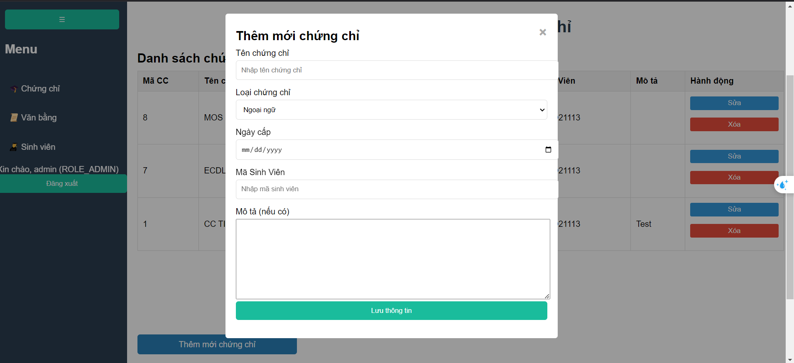

# HỌC PHẦN: CÔNG NGHỆ PHẦN MỀM.
## GV: Nguyễn Đức Anh
## Nhóm 10: Trần Xuân Vũ, Trần Thanh Tùng, Trần Anh Vũ, Phan Thanh Trúc, Nguyễn Duy Mạnh
# Quản lý Thông tin Bằng Tốt Nghiệp Và Chứng Chỉ
Một hệ thống đơn giản để quản lý thông tin sinh viên, bằng tốt nghiệp, và chứng chỉ.

## Giới Thiệu
Dự án này cung cấp một hệ thống web để quản lý thông tin sinh viên, bao gồm thông tin cá nhân, bằng tốt nghiệp, và chứng chỉ.
Phù hợp cho các trường đại học, trung tâm đào tạo muốn số hóa quy trình quản lý.

## Chức Năng Chính
- Thêm, sửa, xóa thông tin sinh viên.
- Tra cứu thông tin tốt nghiệp và chứng chỉ theo mã sinh viên.
- Quản lý thông tin bằng tốt nghiệp và chứng chỉ với giao diện đơn giản.

## Sử dụng

### 1. Đăng nhập (admin)
Người dùng cần đăng nhập với tài khoản quản trị viên (admin) để truy cập vào chức năng quản lý.

### 2. Tra cứu sinh viên (public)
Nhập mã sinh viên vào ô tìm kiếm trên trang chủ, nhấn "Tìm kiếm" để xem thông tin chi tiết.

### 3. Thêm thông tin mới (admin)
Nhấp vào nút "Thêm mới" trên mỗi module (sinh viên, bằng tốt nghiệp, chứng chỉ) để thêm dữ liệu.

## Giao diện
1. Trang Chính

2. Trang Đăng Nhập

3. Trang Quản Lý Thông Tin Chứng Chỉ

4. Trang Quản Lý Thông Tin Văn Bằng

5. Trang Quản Lý Thông Tin Sinh Viên

6. Thêm Mới / Sửa Chứng Chỉ

7. Thêm Mới / Sửa Văn Bằng

8. Thêm Mới / Sửa Sinh Viên
  
9. Demo kết quả tra cứu

